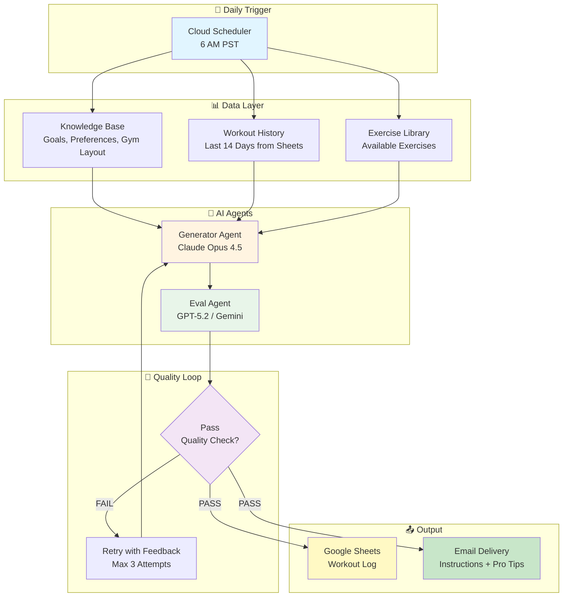
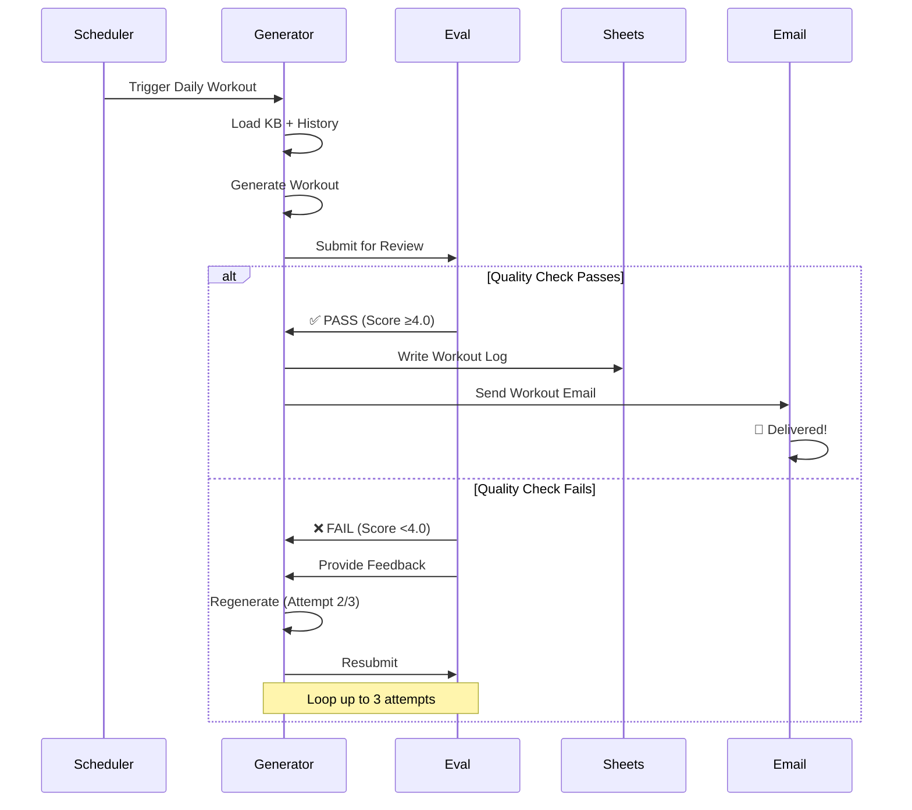
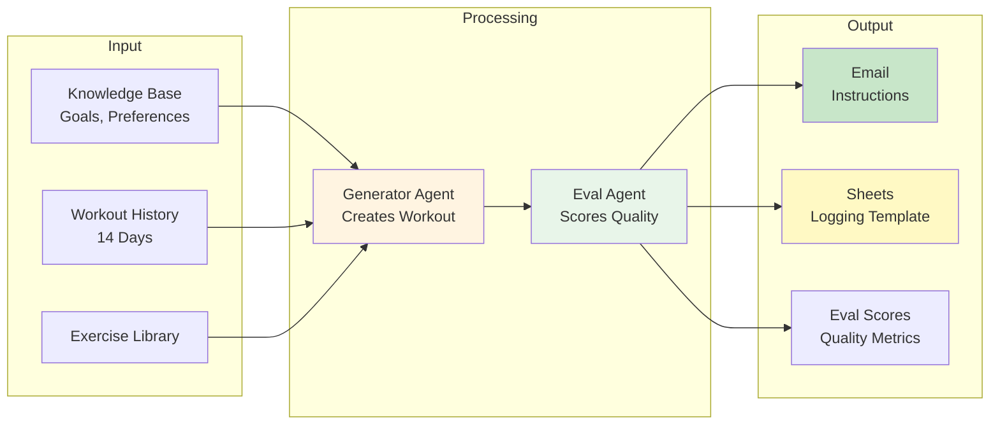

# 💪 Fitness Agent

> **An AI-powered workout planning system that eliminates daily decision fatigue by automatically generating personalized, data-driven workouts with built-in quality evaluation.**

[](https://www.python.org/)
[](LICENSE)
[]()

---

<div align="center" style="background-color: #f0f8ff; padding: 20px; border-radius: 10px; margin: 20px 0;">

## 📧 **6:00 AM. Your phone buzzes.**

You open your email. There it is—your workout for today.

**Subject:** 💪 Saturday, December 27 — Lower Body Strength

You scroll through:
- 📊 **Muscle Balance Analysis**: "Your back only had 8 sets in the last 10 days (target: 12+). Today adds 4 sets of rowing work."
- 🏋️ **Block A**: Barbell RDL, 3 sets × 6-8 reps @ 95 lbs (last session: 90 lbs → +5 lbs progression)
- 💡 **Pro Tip**: "Think 'push hips back' not 'bend forward.' Your shins stay vertical."
- 📍 **Location Flow**: Floor 2 → Floor 1 Machines → Floor 1 Open (minimal transitions)

Everything is there. Your training history. Your progression. Your preferences. Your injury constraints.

**You don't think. You just execute.**

</div>

---

## 🎯 The Problem

### The Real Barrier: Decision Friction

**Have you ever stood in the gym thinking:**
- 🧠 **"What should I do today?"** — Decision fatigue drains mental energy before you even start
- ⏰ **"What did I do last time?"** — Memory limitations lead to inconsistent training
- 📊 **"Am I balanced?"** — No way to track if you're hitting all muscle groups
- ❓ **"Is this workout good?"** — Quality uncertainty means wasted sessions

**Unless and until you have an in-person trainer who helps you, or you put in extra time to think about what it is, you usually are not able to get the most out of your gym time.**

The result? Scrambled workouts, muscle imbalances, inconsistent progress, and most importantly—**mental friction that kills consistency**.

**But here's the thing: There's AI, and it's great. So we should use it.**

---

## ✨ The Solution

**AI can eliminate the friction.** Just like an in-person trainer who knows your history, preferences, and goals, Fitness Agent removes every decision point between you and your workout.

Fitness Agent is a **two-agent AI system** that:

1. **🧠 Generates** personalized workouts using your complete training history
2. **📊 Tracks** muscle balance automatically — never forget what you did
3. **✅ Evaluates** workout quality automatically (no manual review needed)
4. **📧 Delivers** actionable instructions with pro tips via email
5. **💾 Remembers** everything — your system never forgets

**Result**: Wake up at 6 AM → Check email → Go to gym. **Zero decisions. Zero memory. Zero cognitive load. Just execute.**

### What This System Does

**Key Features:**

- ✅ **Two-agent AI system** with automated quality evaluation (Generator + Eval agents working together)
- ✅ **Muscle balance tracking** that analyzes your last 10-14 days automatically and identifies gaps
- ✅ **Google Sheets integration** for seamless workout logging with pre-filled templates
- ✅ **Email delivery** with rich markdown formatting, pro tips, and progression notes
- ✅ **Model fallback strategy** ensuring 99.9% reliability (Claude Opus 4.5 → Gemini 1.5 Flash → GPT-5.2)
- ✅ **Deployed to production** on Google Cloud Functions with Cloud Scheduler automation
- ✅ **Knowledge base system** that remembers your goals, preferences, injury constraints, and gym layout
- ✅ **Gym efficiency** optimization (one block = one location, minimal breaks between sets, maintains focus)
- ✅ **Automated progression tracking** that references previous workout weights and suggests increases
- ✅ **Quality assurance** with 4-dimensional scoring (Structure, Selection, Progression, Gym Efficiency) and auto-retry
- ✅ **Customizable rest/trainer days** that automatically skip specified days
- ✅ **Zero-configuration daily delivery** — runs automatically every morning at 6 AM PST

---

## 🎓 About This Repository

**This is the open-source foundation.** This repository provides the core architecture, code, and templates needed to build your own personalized fitness agent.

I use a more advanced version for my personal system with additional features, refined prompts, and deeper knowledge base customization. If you want the full templates, prompts, and implementation guide, [sign up here / check out the course / join the waitlist].

**What's Included:**
- ✅ Complete two-agent system architecture
- ✅ Template knowledge base files (goals, preferences, gym layout, etc.)
- ✅ Sanitized prompt templates
- ✅ Full deployment guide for Google Cloud Platform
- ✅ All source code (Python)

**What's Not Included (Personal/Advanced):**
- ❌ My personal knowledge base files (goals, preferences, gym layout)
- ❌ My full prompt templates (the "magic" tuning)
- ❌ Advanced evaluation framework details
- ❌ Health data integrations (Whoop, etc.)

**The goal:** You can take this repository, customize the KB files for your own goals and gym, and deploy your own version. See [docs/CUSTOMIZATION.md](docs/CUSTOMIZATION.md) for details.

---

## 🏗️ Architecture

### System Overview



### Agent Workflow



### Data Flow



---

## 🚀 Key Features

### 📊 **Muscle Balance Tracking** — Never Forget What You Did

**The Problem You Know Too Well:**

> "Wait, did I do back yesterday or was that last week? Am I hitting my legs enough? Are my quads getting more work than my hamstrings?"

**The Solution:**

Fitness Agent analyzes your **last 10-14 days** of workouts and automatically tracks sets per muscle group:

| Muscle Group | Target (10 days) | What Gets Tracked |
|--------------|------------------|-------------------|
| **Chest** | 12+ sets | Bench, chest press, flies |
| **Back/Lats** | 12+ sets | Rows, pulldowns, pull-ups |
| **Legs (Quads)** | 12+ sets | Squats, leg press, extensions, lunges |
| **Legs (Posterior)** | 12+ sets | RDL, deadlift, hamstring curl, glutes |
| **Shoulders** | 8+ sets | Press, raises, face pulls |
| **Arms** | 8+ sets | Curls, pushdowns, extensions |
| **Core** | 8+ sets | Planks, deadbugs, leg raises |

**How It Works:**

Every workout email includes a **Muscle Balance Analysis** callout:

```
📊 Muscle Balance Analysis:
Your back only had 8 sets in the last 10 days (target: 12+). 
Today's workout adds 4 sets of rowing work to address this gap.
```

**The Result:**

- ✅ **No more guessing** — The system remembers everything you did
- ✅ **Automatic corrections** — Under-hit muscle groups get prioritized
- ✅ **Balanced training** — No more "oops, I forgot to do back this week"
- ✅ **Injury prevention** — Balanced muscle development reduces injury risk

**You never have to remember. The system remembers for you.**

---

### 🧠 Long-Term Memory & Context

The system maintains a comprehensive knowledge base:

- **📋 Goals**: Primary targets (e.g., triathlon, body composition, strength)
- **🏋️ Exercise Library**: Available exercises with movement patterns
- **🏢 Gym Layout**: Gym floor layout and equipment locations for efficient workout flow
- **📊 Workout History**: Last 14 days of training data (automatically tracked)
- **⚙️ Preferences**: Loved exercises, injury constraints, training style

**Result**: Every workout is informed by your complete training context, not just today's prompt. **The system remembers what you forget.**

### ✅ Automated Quality Evaluation

The Eval Agent scores workouts across 4 dimensions:

| Category | What It Checks | Weight |
|----------|---------------|--------|
| **Structure** | Warm-up → Blocks → Cooldown, day type match | 25% |
| **Selection** | From library, no forbidden exercises, proper sequence | 25% |
| **Progression** | References previous weights, respects constraints | 25% |
| **Gym Efficiency** | One block = one location, minimal breaks between sets, maintains focus | 25% |

**Pass Threshold**: Overall score ≥ 4.0/5.0 = ✅ PASS

**Auto-Retry**: If quality check fails, the system automatically regenerates with feedback (up to 3 attempts).

### 📧 Rich Email Delivery

Every workout email includes:

- **📅 Day Overview**: Target metrics, session length, strain goals
- **🏋️ Exercise Details**: Sets, reps, weights, rest periods, pro tips
- **📍 Location Flow**: Floor-by-floor organization for efficiency
- **💡 Pro Tips**: Form cues, progression notes, injury prevention
- **⚠️ Guardrails**: Safety notes, alternatives, must-follow rules
- **📊 Quality Scores**: Eval metrics for transparency

### 📊 Automated Tracking

- **Google Sheets Integration**: Pre-filled workout logs ready for quick entry
- **Eval Score Tracking**: Quality metrics logged for monitoring
- **Monthly Sheet Rotation**: Organized by month for easy reference
- **Progress Tracking**: Historical data feeds back into future workouts

---

## 🛠️ Technical Stack

### Core Components

```
fitness-agent/
├── src/
│   ├── main.py                  # Cloud Function orchestrator
│   ├── generator_agent.py       # Generator agent (Claude Opus 4.5)
│   ├── eval_agent.py            # Eval agent (GPT-5.2 / Gemini)
│   ├── sheets_client.py         # Google Sheets operations
│   ├── email_client.py          # Email notifications (SendGrid)
│   └── config.py                # Configuration & model priorities
├── kb/                          # Knowledge base (customize these!)
│   ├── goals.md
│   ├── status.md
│   ├── preferences.md
│   ├── exercise_library.md
│   └── gym_layout.md
├── prompts/                     # System prompts
│   ├── generator_prompt.md
│   └── eval_prompt.md
└── requirements.txt
```

### Model Fallback Strategy

**Generator Agent** (Priority Order):
1. 🥇 Claude Opus 4.5 (Primary)
2. 🥈 Gemini 1.5 Flash (Fallback 1)
3. 🥉 GPT-5.2 (Fallback 2)

**Eval Agent** (Priority Order):
1. 🥇 GPT-5.2 (Primary)
2. 🥈 Gemini 1.5 Flash (Fallback 1)
3. 🥉 Claude Opus 4.5 (Fallback 2)

**Why Different Models?** Ensures diversity - the model that generates doesn't evaluate, reducing bias.

---

## 📦 Installation & Setup

### Prerequisites

- Python 3.9+
- Google Cloud Platform account (for Cloud Functions/Cloud Run)
- API Keys:
  - Anthropic API key (Claude)
  - OpenAI API key (GPT) or Gemini API key
  - SendGrid API key (email)
- Google Sheets API credentials (service account)

### Quick Start

1. **Clone the repository**
   ```bash
   git clone https://github.com/veritas6161/fitness-agent-rr-opensource.git
   cd fitness-agent-rr-opensource
   ```

2. **Install dependencies**
   ```bash
   pip install -r requirements.txt
   ```

3. **Customize Knowledge Base Files**
   
   Edit the files in `kb/` to match your goals, preferences, and gym:
   - `kb/goals.md` - Your fitness goals and targets
   - `kb/status.md` - Current status and training setup
   - `kb/preferences.md` - Exercise preferences and injury constraints
   - `kb/gym_layout.md` - Your gym's layout and equipment
   - `kb/exercise_library.md` - Available exercises (already populated)

   See [docs/CUSTOMIZATION.md](docs/CUSTOMIZATION.md) for detailed guidance.

4. **Configure environment variables**
   
   Create a `.env` file in the root directory:
   ```bash
   # API Keys
   ANTHROPIC_API_KEY=your-anthropic-key
   OPENAI_API_KEY=your-openai-key
   GEMINI_API_KEY=your-gemini-key
   
   # Email
   SENDGRID_API_KEY=your-sendgrid-key
   EMAIL_RECIPIENT=your-email@example.com
   
   # Google Sheets
   SPREADSHEET_ID=your-google-sheets-id
   GOOGLE_CREDENTIALS='{"type":"service_account",...}'
   ```

5. **Test locally**
   ```bash
   cd src
   # Test API keys
   python3 test_keys.py
   
   # Test email integration (if SendGrid is configured)
   python3 test_email.py
   
   # Test Sheets integration
   python3 test_sheets.py
   
   # Test full workflow
   python3 main.py
   ```

6. **Deploy to Cloud Functions** (see [Deployment Guide](docs/DEPLOYMENT.md))
   ```bash
   gcloud functions deploy fitness-agent \
     --gen2 \
     --runtime python39 \
     --trigger-http \
     --allow-unauthenticated \
     --entry-point generate_workout \
     --source src \
     --region us-central1
   ```

7. **Set up Cloud Scheduler** (6 AM PST daily)
   ```bash
   gcloud scheduler jobs create http fitness-agent-daily \
     --location=us-central1 \
     --schedule="0 6 * * *" \
     --uri="[FUNCTION_URL]?trigger=cron" \
     --http-method=GET \
     --time-zone="America/Los_Angeles"
   ```

   For detailed deployment instructions, see [docs/DEPLOYMENT.md](docs/DEPLOYMENT.md).

### Configuration

Key settings in `src/config.py`:

```python
MAX_EVAL_ATTEMPTS = 3  # Retry limit for quality check
GENERATOR_MODEL_PRIORITY = [
    {"provider": "anthropic", "model": "claude-opus-4-5-20251101"},
    {"provider": "gemini", "model": "gemini-1.5-flash"},
    {"provider": "openai", "model": "gpt-5.2"},
]
```

---

## 🎬 Usage

### Daily Workflow

1. **🌅 6 AM PST**: System automatically triggers
2. **🤖 Generation**: Generator Agent creates personalized workout
3. **✅ Evaluation**: Eval Agent scores quality (auto-retry if needed)
4. **📧 Delivery**: Workout email arrives in your inbox
5. **💪 Morning**: Open email, go to gym, log results in Sheets

### Manual Trigger

For testing or manual generation:

```bash
cd src
python3 main.py
```

Output includes:
- Full workout email content
- Eval scores and feedback
- Response summary

---

## 🚀 Deployment

### Quick Start

For complete setup and deployment instructions, see:
- **[Setup Guide](docs/SETUP.md)** - Initial configuration and API key setup
- **[Deployment Guide](docs/DEPLOYMENT.md)** - Cloud Functions deployment and Cloud Scheduler setup
- **[Customization Guide](docs/CUSTOMIZATION.md)** - How to personalize KB files for your goals

### Deployment Checklist

1. ✅ **Customize KB files** - Edit `kb/` files for your goals and gym
2. ✅ **Test locally** - Run `python3 src/main.py` to verify workflow
3. ✅ **Set up SendGrid** - Create account and get API key (see [Setup Guide](docs/SETUP.md))
4. ✅ **Deploy to Cloud Functions** - Follow [Deployment Guide](docs/DEPLOYMENT.md)
5. ✅ **Set up Cloud Scheduler** - Daily trigger at 6 AM PST
6. ✅ **Monitor and verify** - Check logs and email delivery

### Environment Variables

All required environment variables must be set in Cloud Functions:
- `ANTHROPIC_API_KEY` - Claude API (Generator primary)
- `OPENAI_API_KEY` - GPT API (Eval primary)
- `GEMINI_API_KEY` - Gemini API (Fallback)
- `SENDGRID_API_KEY` - Email sending
- `EMAIL_RECIPIENT` - Workout email destination
- `SPREADSHEET_ID` - Google Sheets ID
- `GOOGLE_CREDENTIALS` - Service account JSON

See [docs/SETUP.md](docs/SETUP.md) for detailed setup instructions.

---

## 🔮 Future Enhancements

### 🍎 Nutrition Integration
- Automated meal planning based on workout schedule
- Macro tracking and adjustments
- Meal prep suggestions

### 📊 Health Data Integration
- Whoop device integration (recovery, HRV, sleep)
- Workout adjustments based on recovery metrics
- Data-driven rest day recommendations

### 📈 Advanced Analytics
- Performance trend analysis
- Predictive progression modeling
- Personalized recovery recommendations
- Muscle group balance tracking

---

## 🏗️ Project Structure

```
fitness-agent-rr-opensource/
├── src/                        # Source code
│   ├── main.py                 # Orchestrator
│   ├── generator_agent.py      # Generator implementation
│   ├── eval_agent.py           # Eval implementation
│   ├── sheets_client.py        # Sheets operations
│   ├── email_client.py         # Email delivery
│   ├── config.py               # Configuration
│   └── test_*.py               # Test files
├── kb/                         # Knowledge base (CUSTOMIZE THESE!)
│   ├── goals.md
│   ├── status.md
│   ├── preferences.md
│   ├── exercise_library.md
│   └── gym_layout.md
├── prompts/                    # System prompts
│   ├── generator_prompt.md
│   └── eval_prompt.md
├── docs/                       # Documentation
│   ├── SETUP.md
│   ├── DEPLOYMENT.md
│   └── CUSTOMIZATION.md
├── requirements.txt
├── LICENSE
└── README.md                   # This file
```

---

## 🤝 Contributing

This is an open-source project! Contributions are welcome:

1. Fork the repository
2. Create a feature branch
3. Make your changes
4. Submit a pull request

---

## 📄 License

[MIT License](LICENSE)

---

## 🙏 Acknowledgments

- Built with [Claude Opus 4.5](https://www.anthropic.com/), [GPT-5.2](https://openai.com/), and [Gemini](https://deepmind.google/technologies/gemini/)
- Email delivery via [SendGrid](https://sendgrid.com/)
- Data storage via [Google Sheets API](https://developers.google.com/sheets/api)

---

## 📞 Contact

For questions or feedback, open an issue on GitHub.

---

<div align="center">

**💪 Eliminate decision fatigue. Automate your workouts. Focus on training.**

Made with ❤️ for fitness enthusiasts who value their time and mental energy.

</div>
