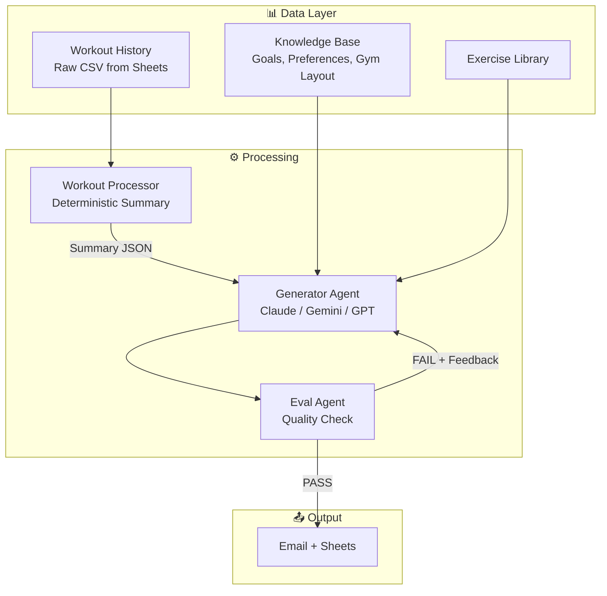

# 💪 Fitness Agent

> **An AI-powered workout planning system that eliminates daily decision fatigue by automatically generating personalized, data-driven workouts with built-in quality evaluation.**

[](https://www.python.org/)
[](LICENSE)

---

## 📧 **6:00 AM. Your phone buzzes.**

You open your email. There it is—your workout for today.

**Subject:** 💪 Saturday, December 27 — Lower Body Strength

You scroll through:
- 📊 **Muscle Balance Analysis**: "Your back only had 8 sets in the last 10 days (target: 12+). Today adds 4 sets of rowing work."
- 🏋️ **Block A**: Barbell RDL, 3 sets × 6-8 reps @ 95 lbs (last session: 90 lbs → +5 lbs progression)
- 💡 **Pro Tip**: "Think 'push hips back' not 'bend forward.' Your shins stay vertical."
- 📍 **Location Flow**: Floor 2 → Floor 1 Machines → Floor 1 Open (minimal transitions)

Everything is there. Your training history. Your progression. Your preferences. Your injury constraints.

**You don't think. You just execute.**

---

## 🎯 The Problem

**Have you ever stood in the gym thinking:**
- 🧠 **"What should I do today?"** — Decision fatigue drains mental energy before you even start
- ⏰ **"What did I do last time?"** — Memory limitations lead to inconsistent training
- 📊 **"Am I balanced?"** — No way to track if you're hitting all muscle groups
- ❓ **"Is this workout good?"** — Quality uncertainty means wasted sessions

Unless you have an in-person trainer or put in extra time to plan, you usually aren't getting the most out of your gym time. The result? Scrambled workouts, muscle imbalances, inconsistent progress, and most importantly—**mental friction that kills consistency**.

**But here's the thing: There's AI, and it's great. So we should use it.**

---

## ✨ The Solution

**AI can eliminate the friction.** Just like an in-person trainer who knows your history, preferences, and goals, Fitness Agent removes every decision point between you and your workout.

Fitness Agent is a **two-agent AI system** that:

1. **🧠 Generates** personalized workouts using your complete training history
2. **📊 Tracks** muscle balance automatically — never forget what you did
3. **✅ Evaluates** workout quality automatically (no manual review needed)
4. **📧 Delivers** actionable instructions with pro tips via email
5. **💾 Remembers** everything — your system never forgets

**Result**: Wake up at 6 AM → Check email → Go to gym. **Zero decisions. Zero memory. Zero cognitive load. Just execute.**

---

## 🏗️ Architecture



**Key Design Decisions:**

- **Deterministic preprocessing** — Raw workout CSV from Google Sheets is processed into structured summary JSON before AI calls. This extracts exercise history, counts sets per muscle group, tracks weights for progression, and calculates volume metrics. The result is efficient token usage and better AI outputs.

- **Two-agent system** — The Generator Agent creates workouts while a separate Eval Agent scores them across 4 dimensions. Using different models for each (e.g., Claude for generation, GPT for evaluation) reduces bias and improves quality.

- **Model fallback strategy** — Claude Opus 4.5 → Gemini 1.5 Flash → GPT-5.2 ensures 99.9% reliability. If the primary model fails, the system automatically tries the next one.

- **Quality loop with auto-retry** — If a workout fails the quality check (score < 4.0/5.0), the system automatically regenerates with feedback, up to 3 attempts.

---

## 🚀 Key Features

### 📊 Muscle Balance Tracking

The system analyzes your last 10-14 days of workouts and tracks sets per muscle group. If any muscle group falls below the target (e.g., back has only 8 sets when target is 12+), today's workout automatically prioritizes that group. Every email includes a "Muscle Balance Analysis" callout so you know exactly why certain exercises were chosen.

### ✅ Automated Quality Evaluation

The Eval Agent scores workouts across 4 dimensions:

| Category | What It Checks |
|----------|---------------|
| **Structure** | Warm-up → Blocks → Cooldown, day type matches content |
| **Selection** | Exercises from library, no forbidden exercises, proper sequencing |
| **Progression** | References previous weights, respects injury constraints |
| **Gym Efficiency** | One block = one location, minimal floor transitions |

Workouts need a score ≥ 4.0/5.0 to pass. If they fail, the system regenerates with specific feedback.

### 🏢 Gym-Aware Workout Design

The system knows your gym's layout and designs workouts to minimize time walking between floors. Each block of exercises happens in one location—complete all exercises before moving to the next area.

### 📈 Smart Progression

The system references your previous workout weights and suggests appropriate increases. If you did 90 lbs last week, it might suggest 95 lbs this week with a note like "Last session: 90 lbs → Today: 95 lbs (+5 lbs progression)."

### 🛡️ Injury Constraint Enforcement

Your injury history is stored in the preferences KB file. The system will never program exercises that violate your constraints (e.g., no push-ups if you have wrist issues) and will suggest alternatives.

---

## 📦 Getting Started

### Prerequisites

- Python 3.9+
- Google Cloud Platform account (for deployment)
- API Keys: Anthropic (Claude), OpenAI (GPT), Google (Gemini), SendGrid (email)
- Google Sheets API credentials (service account)

### Step 1: Clone & Install

```bash
git clone https://github.com/veritas6161/fitness-agent-rr-opensource.git
cd fitness-agent-rr-opensource
pip install -r requirements.txt
```

### Step 2: Customize Your Knowledge Base

The system uses Knowledge Base (KB) files to understand your goals, preferences, and gym. Edit the files in `kb/` to match your situation:

| File | What to Customize |
|------|-------------------|
| `goals.md` | Your primary fitness goal, body composition targets, weekly training targets |
| `preferences.md` | Exercises you love/hate, injury history and constraints, training style |
| `gym_layout.md` | Your gym's floor layout, equipment locations, workout design rules |
| `status.md` | Current body composition, training frequency, weekly schedule |
| `exercise_library.md` | Available exercises at your gym (already populated with common exercises) |

See [docs/CUSTOMIZATION.md](docs/CUSTOMIZATION.md) for detailed guidance on each file.

### Step 3: Configure Environment Variables

Create a `.env` file in the root directory:

```bash
# API Keys
ANTHROPIC_API_KEY=your-anthropic-key
OPENAI_API_KEY=your-openai-key
GEMINI_API_KEY=your-gemini-key

# Email
SENDGRID_API_KEY=your-sendgrid-key
EMAIL_RECIPIENT=your-email@example.com

# Google Sheets
SPREADSHEET_ID=your-google-sheets-id
GOOGLE_CREDENTIALS='{"type":"service_account",...}'
```

### Step 4: Test Locally

```bash
cd src

# Test that API keys are configured correctly
python3 test_keys.py

# Test email delivery
python3 test_email.py

# Test Google Sheets integration
python3 test_sheets.py

# Run the full workflow
python3 main.py
```

### Step 5: Deploy to Google Cloud

Deploy to Cloud Functions for automated daily delivery:

```bash
gcloud functions deploy fitness-agent \
  --gen2 \
  --runtime python39 \
  --trigger-http \
  --allow-unauthenticated \
  --entry-point generate_workout \
  --source src \
  --region us-central1
```

Set up Cloud Scheduler to trigger at 6 AM daily:

```bash
gcloud scheduler jobs create http fitness-agent-daily \
  --location=us-central1 \
  --schedule="0 6 * * *" \
  --uri="[FUNCTION_URL]?trigger=cron" \
  --http-method=GET \
  --time-zone="America/Los_Angeles"
```

For complete deployment instructions, see [docs/DEPLOYMENT.md](docs/DEPLOYMENT.md).

---

## 🎬 Daily Usage

Once deployed, the system runs automatically:

1. **6:00 AM** — Cloud Scheduler triggers the function
2. **Processing** — System loads your KB files and past 14 days of workouts from Sheets
3. **Generation** — Generator Agent creates a personalized workout
4. **Evaluation** — Eval Agent scores the workout (auto-retry if needed)
5. **Delivery** — Workout email arrives in your inbox with a link to log in Sheets
6. **Your morning** — Open email, go to gym, log your results

For manual testing or on-demand generation, run `python3 src/main.py` locally.

---

## 🗂️ Project Structure

```
fitness-agent/
├── src/                    # Python source code
│   ├── main.py             # Cloud Function orchestrator
│   ├── generator_agent.py  # Workout generation with model fallback
│   ├── eval_agent.py       # Quality evaluation and scoring
│   ├── sheets_client.py    # Google Sheets read/write operations
│   ├── email_client.py     # SendGrid email delivery
│   └── config.py           # Configuration and model priorities
├── kb/                     # Knowledge base files (CUSTOMIZE THESE)
│   ├── goals.md
│   ├── preferences.md
│   ├── gym_layout.md
│   ├── status.md
│   └── exercise_library.md
├── prompts/                # System prompts for Generator and Eval agents
├── docs/                   # Setup, Deployment, and Customization guides
└── requirements.txt
```

---

## 🎓 About This Repository

**This is the open-source foundation.** This repository provides the core architecture, code, and templates needed to build your own personalized fitness agent.

**What's Included:**
- Complete two-agent system architecture
- Template knowledge base files ready for customization
- Sanitized prompt templates
- Full deployment guide for Google Cloud Platform
- All source code (Python)

**What's Not Included:**
- My personal knowledge base files
- My full prompt templates (the "magic" tuning)
- Health data integrations (Whoop, etc.)

**The goal:** Fork this repository, customize the KB files for your own goals and gym, and deploy your own version.

---

## 📄 License

[MIT License](LICENSE)

---

<div align="center">

**💪 Eliminate decision fatigue. Automate your workouts. Focus on training.**

Made with ❤️ for fitness enthusiasts who value their time and mental energy.

</div>
