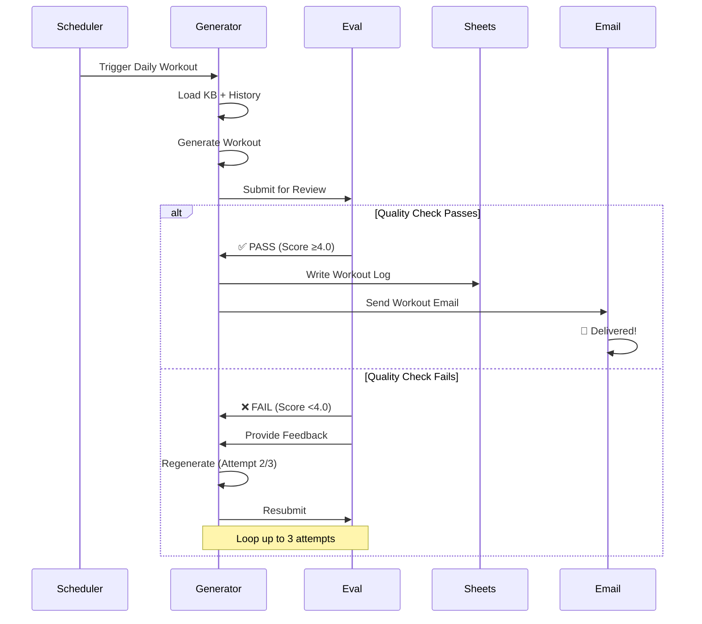
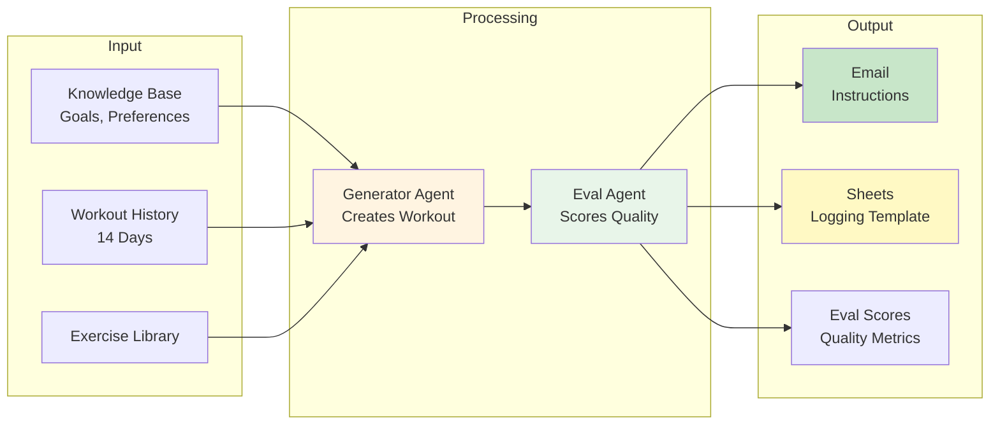

# 💪 Fitness Agent

> **An AI-powered workout planning system that eliminates daily decision fatigue by automatically generating personalized, data-driven workouts with built-in quality evaluation.**

[](https://www.python.org/)
[](LICENSE)
[]()

---

## 🎯 The Problem

Every day, you face the same question: **"What should I do at the gym today?"**

- 🧠 **Decision Fatigue**: Choosing exercises, sets, reps, and weights drains mental energy
- ⏰ **Time Cost**: Daily prompting, reviewing, providing feedback, and iterating takes 15-30 minutes
- 📝 **Memory Limitations**: Manually tracking progress, patterns, and preferences is error-prone
- ❓ **Quality Uncertainty**: No objective way to know if a workout actually meets your goals

**What if your workout was waiting in your inbox every morning, perfectly tailored to your goals, progress, and preferences?**

---

## ✨ The Solution

Fitness Agent is a **two-agent AI system** that:

1. **🧠 Generates** personalized workouts using your long-term training history
2. **✅ Evaluates** workout quality automatically (no manual review needed)
3. **📧 Delivers** actionable instructions with pro tips via email
4. **📊 Tracks** everything automatically in Google Sheets

**Result**: Wake up → Check email → Go to gym. Zero decisions. Zero prompting. Zero cognitive load.

---

## 🏗️ Architecture

### System Overview


### Agent Workflow



### Data Flow



---

## 🚀 Key Features

### 🧠 Long-Term Memory & Context

The system maintains a comprehensive knowledge base:

- **📋 Goals**: Primary targets (e.g., Ironman 70.3, body composition)
- **🏋️ Exercise Library**: Available exercises with movement patterns
- **🏢 Gym Layout**: Spatial constraints and equipment locations
- **📊 Workout History**: Last 14 days of training data
- **⚙️ Preferences**: Loved exercises, injury constraints, training style

**Result**: Every workout is informed by your complete training context, not just today's prompt.

### ✅ Automated Quality Evaluation

The Eval Agent scores workouts across 4 dimensions:

| Category | What It Checks | Weight |
|----------|---------------|--------|
| **Structure** | Warm-up → Blocks → Cooldown, day type match | 25% |
| **Selection** | From library, no forbidden exercises, proper sequence | 25% |
| **Progression** | References previous weights, respects constraints | 25% |
| **Spatial** | One block = one location, minimal transitions | 25% |

**Pass Threshold**: Overall score ≥ 4.0/5.0 = ✅ PASS

**Auto-Retry**: If quality check fails, the system automatically regenerates with feedback (up to 3 attempts).

### 📧 Rich Email Delivery

Every workout email includes:

- **📅 Day Overview**: Target metrics, session length, strain goals
- **🏋️ Exercise Details**: Sets, reps, weights, rest periods, pro tips
- **📍 Location Flow**: Floor-by-floor organization for efficiency
- **💡 Pro Tips**: Form cues, progression notes, injury prevention
- **⚠️ Guardrails**: Safety notes, alternatives, must-follow rules
- **📊 Quality Scores**: Eval metrics for transparency

**Example Structure**:
```
# Saturday, December 27 — Lower Body Strength

## Warm-Up (5 min)
## Block A: Heavy Compounds (Floor 2)
  - Barbell RDL (3 sets × 6-8 reps)
  - Barbell Back Squat (3 sets × 6-8 reps)
## Block B: Accessory/Pump (Floor 1)
  - Leg Press, Leg Extension, Hamstring Curl...
## Block C: Core + Zone 2
  - Deadbug, Side Plank, Farmer Carries
## Cooldown (5 min)

📊 Quality Score: 4.5/5.0
```

### 📊 Automated Tracking

- **Google Sheets Integration**: Pre-filled workout logs ready for quick entry
- **Eval Score Tracking**: Quality metrics logged for monitoring
- **Monthly Sheet Rotation**: Organized by month for easy reference
- **Progress Tracking**: Historical data feeds back into future workouts

---

## 🛠️ Technical Stack

### Core Components

```
fitness-agent/
├── main.py                  # Cloud Function orchestrator
├── generator_agent.py       # Generator agent (Claude Opus 4.5)
├── eval_agent.py            # Eval agent (GPT-5.2 / Gemini)
├── sheets_client.py         # Google Sheets operations
├── email_client.py          # Email notifications (SendGrid)
├── config.py                # Configuration & model priorities
└── prompts/
    ├── generator_prompt.md   # Generator system prompt
    └── eval_prompt.md       # Eval system prompt
```

### Model Fallback Strategy

**Generator Agent** (Priority Order):
1. 🥇 Claude Opus 4.5 (Primary)
2. 🥈 Gemini 1.5 Flash (Fallback 1)
3. 🥉 GPT-5.2 (Fallback 2)

**Eval Agent** (Priority Order):
1. 🥇 GPT-5.2 (Primary)
2. 🥈 Gemini 1.5 Flash (Fallback 1)
3. 🥉 Claude Opus 4.5 (Fallback 2)

**Why Different Models?** Ensures diversity - the model that generates doesn't evaluate, reducing bias.

### Knowledge Base Structure

```
kb/
├── goals.md              # Primary targets, weekly metrics
├── status.md             # Current body comp, training setup
├── preferences.md        # Loved exercises, injury constraints
├── exercise_library.md   # Available exercises by movement
└── gym_layout.md        # Floor layout, spatial rules
```

---

## 📦 Installation & Setup

### Prerequisites

- Python 3.9+
- Google Cloud Platform account (for Cloud Functions/Cloud Run)
- API Keys:
  - Anthropic API key (Claude)
  - OpenAI API key (GPT) or Gemini API key
  - SendGrid API key (email)
- Google Sheets API credentials (service account)

### Quick Start

1. **Clone the repository**
   ```bash
   git clone https://github.com/veritas6161/fitness-agent-rr.git
   cd fitness-agent-rr
   ```

2. **Install dependencies**
   ```bash
   cd fitness-agent
   pip install -r requirements.txt
   ```

3. **Configure environment variables**
   
   Create a `.env` file in `fitness-agent/`:
   ```bash
   # API Keys
   ANTHROPIC_API_KEY=your-anthropic-key
   OPENAI_API_KEY=your-openai-key
   GEMINI_API_KEY=your-gemini-key
   
   # Email
   SENDGRID_API_KEY=your-sendgrid-key
   EMAIL_RECIPIENT=your-email@example.com
   
   # Google Sheets
   SPREADSHEET_ID=your-google-sheets-id
   GOOGLE_CREDENTIALS='{"type":"service_account",...}'
   ```

4. **Test locally**
   ```bash
   python3 main.py
   ```

5. **Deploy to Cloud Run** (optional)
   ```bash
   gcloud run deploy fitness-agent \
     --source . \
     --platform managed \
     --region us-central1
   ```

### Configuration

Key settings in `config.py`:

```python
MAX_EVAL_ATTEMPTS = 3  # Retry limit for quality check
GENERATOR_MODEL_PRIORITY = [
    {"provider": "anthropic", "model": "claude-opus-4-5-20251101"},
    {"provider": "gemini", "model": "gemini-1.5-flash"},
    {"provider": "openai", "model": "gpt-5.2"},
]
```

---

## 🎬 Usage

### Daily Workflow

1. **🌙 9 PM PST**: System automatically triggers
2. **🤖 Generation**: Generator Agent creates personalized workout
3. **✅ Evaluation**: Eval Agent scores quality (auto-retry if needed)
4. **📧 Delivery**: Workout email arrives in your inbox
5. **💪 Morning**: Open email, go to gym, log results in Sheets

### Manual Trigger

For testing or manual generation:

```bash
cd fitness-agent
python3 main.py
```

Output includes:
- Full workout email content
- Eval scores and feedback
- Response summary

### Example Output

```
================================================================================
FULL WORKOUT EMAIL OUTPUT
================================================================================

# Saturday, December 27 — Lower Body Strength

**Target:** 9 exercises | **HR Target:** >135 | **Session Length:** 50-55 min

## Warm-Up (5 min)
- Foam roll, dynamic stretches

## Block A: Heavy Compounds
- Barbell RDL: 3 sets × 6-8 reps @ 95 lbs
- Barbell Back Squat: 3 sets × 6-8 reps @ 115 lbs

[... full workout details ...]

📊 Quality Score: 4.5/5.0
- Structure: 5/5
- Selection: 4/5
- Progression: 4/5
- Spatial: 5/5
```

---

## 📈 Results & Impact

### Time Saved
- **Before**: 15-30 min/day (prompting, review, feedback)
- **After**: 0 min/day (automated)
- **Weekly**: ~2-3.5 hours saved

### Quality Assurance
- **Automated Evaluation**: Every workout scored before delivery
- **Consistency**: No more "bad workout days"
- **Progression**: Data-driven weight increases

### Cognitive Load
- **Before**: Daily decisions, memory of past workouts, planning
- **After**: Zero decisions, system remembers everything

---

## 🔮 Future Enhancements

### 🍎 Nutrition Integration
- Automated meal planning based on workout schedule
- Macro tracking and adjustments
- Meal prep suggestions

### 📊 Health Data Integration
- Whoop device integration (recovery, HRV, sleep)
- Workout adjustments based on recovery metrics
- Data-driven rest day recommendations

### 📈 Advanced Analytics
- Performance trend analysis
- Predictive progression modeling
- Personalized recovery recommendations
- Muscle group balance tracking

---

## 🏗️ Project Structure

```
Fitness Agent/
├── fitness-agent/              # Main application
│   ├── main.py                 # Orchestrator
│   ├── generator_agent.py      # Generator implementation
│   ├── eval_agent.py           # Eval implementation
│   ├── sheets_client.py        # Sheets operations
│   ├── email_client.py         # Email delivery
│   ├── config.py               # Configuration
│   ├── kb/                     # Knowledge base
│   │   ├── goals.md
│   │   ├── status.md
│   │   ├── preferences.md
│   │   ├── exercise_library.md
│   │   └── gym_layout.md
│   └── prompts/                # System prompts
│       ├── generator_prompt.md
│       └── eval_prompt.md
├── docs/                       # Documentation
│   ├── BUILD_PLAN.md
│   ├── GITHUB_SETUP.md
│   └── PRD.md
└── README.md                   # This file
```

---

## 🤝 Contributing

This is a personal project, but suggestions and feedback are welcome!

1. Fork the repository
2. Create a feature branch
3. Make your changes
4. Submit a pull request

---

## 📄 License

[Your License Here]

---

## 🙏 Acknowledgments

- Built with [Claude Opus 4.5](https://www.anthropic.com/), [GPT-5.2](https://openai.com/), and [Gemini](https://deepmind.google/technologies/gemini/)
- Email delivery via [SendGrid](https://sendgrid.com/)
- Data storage via [Google Sheets API](https://developers.google.com/sheets/api)

---

## 📞 Contact

For questions or feedback, open an issue on GitHub.

---

<div align="center">

**💪 Eliminate decision fatigue. Automate your workouts. Focus on training.**

Made with ❤️ for fitness enthusiasts who value their time and mental energy.

</div>
