# Fitness Agent

An intelligent workout planning system that eliminates daily decision-making overhead by automatically generating personalized, data-driven workouts with built-in quality evaluation.

```mermaid
graph TD
    A[🌙 Daily Trigger<br/>9 PM PST] --> B[📊 Load Data<br/>KB Files + Past Workouts]
    B --> C[🤖 Generator Agent<br/>Claude Opus 4.5]
    C --> D[✅ Eval Agent<br/>GPT/Gemini]
    D -->|FAIL| E[🔄 Retry with Feedback<br/>Max 3 Attempts]
    E --> C
    D -->|PASS| F[📝 Log to Sheets<br/>Workout Tab + Eval Scores]
    F --> G[📧 Email Delivery<br/>Instructions + Pro Tips + Sheet Link]
    G --> H[💪 Ready to Workout<br/>No Daily Decisions Needed]
    
    style A fill:#e1f5ff
    style C fill:#fff4e1
    style D fill:#e8f5e9
    style F fill:#f3e5f5
    style G fill:#fff9c4
    style H fill:#c8e6c9
```



## The Problem

Daily workout planning creates friction:
- **Decision fatigue**: Choosing what to do each day
- **Time cost**: Prompting, reviewing, providing feedback, iterating
- **Memory limitations**: Tracking progress, patterns, and preferences manually
- **Quality uncertainty**: No objective evaluation of workout quality

## The Solution

A two-agent system that:
1. **Generates** personalized workouts using long-term memory and data-driven planning
2. **Evaluates** workout quality automatically, eliminating the need for manual review
3. **Delivers** actionable instructions and tracking sheets via email
4. **Tracks** everything automatically in Google Sheets

## Key Features

### 🧠 Long-Term Memory & Data-Driven Planning
- Tracks workout history, performance patterns, and preferences
- Uses past 7-14 days of workout data to inform decisions
- Maintains knowledge base of goals, gym layout, exercise library, and performance patterns
- Offloads cognitive load from daily decision-making

### ✅ Automated Quality Evaluation
- Eval agent scores workouts across multiple dimensions:
  - Workout Structure & Preferences
  - Exercise Selection Quality
  - Progression & Safety
  - Spatial Efficiency
- Automatic retry loop (up to 3 attempts) ensures quality before delivery
- No need to manually review or provide feedback

### 📧 Streamlined Delivery
- **Instructions & Pro Tips**: Hyper-customized guidance for each workout
- **Tracking Sheet**: Pre-filled Google Sheet ready for quick logging
- **Voice Logging Support**: Update workouts via voice commands
- Daily email delivery eliminates daily prompting

### 📊 Automated Tracking
- All workouts logged to Google Sheets
- Monthly sheet rotation for organization
- Evaluation scores tracked for quality monitoring
- Summary dashboard with visualizations by day type and exercise category

## Architecture

### Two-Agent System

**Generator Agent** (Claude Opus 4.5)
- Generates personalized workouts based on:
  - Knowledge base (goals, gym layout, performance patterns, workout scripts)
  - Exercise library with historical weights
  - Past workout logs (7-14 days)
  - Day-specific plans (Day 3: Conditioning, Day 4: Upper Body, Day 5: Lower Body, Day 6: Full Body)
- Outputs structured JSON with exercises, sets, reps, weights, rest periods, location flow, and notes

**Eval Agent** (GPT or Gemini - configurable)
- Evaluates generated workouts against quality criteria
- Provides scores and feedback for improvement
- Triggers retry loop if quality threshold not met

### System Components

```
fitness-agent/
├── main.py                  # Cloud Function orchestrator
├── generator_agent.py       # Generator agent implementation
├── eval_agent.py            # Eval agent implementation
├── sheets_client.py         # Google Sheets operations
├── email_client.py          # Email notifications
├── config.py                # Configuration constants
├── requirements.txt         # Python dependencies
└── prompts/
    ├── generator_prompt.md  # Generator system prompt
    └── eval_prompt.md       # Eval system prompt
```

### Knowledge Base

The system uses a knowledge base stored in `old-base-files/`:
- **Fitness Goals**: Personal objectives and priorities
- **Workout Script KB**: Workout structure and flow patterns
- **Performance Patterns**: Historical performance data and trends
- **Gym Layout & Rules**: Spatial constraints and equipment locations
- **Exercise Library**: Exercise database with historical weights
- **Day-Specific Plans**: Templates for each day type

### Workflow

1. **Daily Trigger**: Cloud Scheduler triggers at 9 PM PST
2. **Day Type Determination**: Identifies current day in weekly cycle
3. **Data Loading**: Loads KB files, exercise library, and past workouts
4. **Generation Loop**:
   - Generator creates workout
   - Eval agent scores it
   - If PASS: proceed
   - If FAIL: retry with feedback (max 3 attempts)
5. **Logging**: Creates workout tab in Google Sheets
6. **Evaluation Tracking**: Logs eval scores to Eval History tab
7. **Dashboard Update**: Updates Summary dashboard
8. **Notification**: Sends email with instructions, pro tips, and sheet link

## Setup

### Prerequisites

- Python 3.9+
- Google Cloud Platform account
- Google Sheets API credentials
- Anthropic API key (for Generator Agent)
- OpenAI or Google API key (for Eval Agent)
- SendGrid API key (for email)

### Installation

1. Clone the repository
2. Install dependencies:
```bash
pip install -r fitness-agent/requirements.txt
```

3. Set environment variables:
```bash
export ANTHROPIC_API_KEY="your-anthropic-key"
export OPENAI_API_KEY="your-openai-key"  # or GEMINI_API_KEY
export EVAL_MODEL_PROVIDER="gpt"  # or "gemini"
export EMAIL_RECIPIENT="your-email@example.com"
export SENDGRID_API_KEY="your-sendgrid-key"
export SPREADSHEET_ID="your-google-sheets-id"
export GOOGLE_CREDENTIALS='{"type":"service_account",...}'
```

**Note**: Never commit API keys or credentials to version control. Use environment variables or a secure secrets manager.

4. Configure spreadsheet ID: Set `SPREADSHEET_ID` environment variable or update the placeholder in `config.py`

5. Deploy to Google Cloud Functions or Cloud Run

### Configuration

Key configuration in `config.py`:
- `SPREADSHEET_ID`: Google Sheets ID for workout tracking
- `MAX_EVAL_ATTEMPTS`: Maximum retry attempts (default: 3)
- `GENERATOR_MODEL`: Generator model (default: "claude-opus-4.5")
- `EVAL_MODEL_PROVIDER`: Eval provider ("gpt" or "gemini")

## Iteration & Development

This project has gone through multiple iterations:

- **Initial Version**: Manual prompting and review workflow
- **Current Version**: Two-agent system with automated evaluation
- **Knowledge Base Evolution**: KB files have been refined through multiple versions
- **Evaluation Framework**: Eval criteria developed and refined through testing

See `BUILD_PLAN.md` for detailed implementation plan and `old-base-files/` for previous iteration materials.

## Results

- **Time Saved**: Eliminates daily prompting, review, and feedback cycles
- **Quality Assurance**: Automated evaluation ensures consistent workout quality
- **Data-Driven Decisions**: Long-term memory enables better progression and variety
- **Reduced Cognitive Load**: No daily decision-making required

## Future Plans

### Food Automation
- Integration with meal planning and nutrition tracking
- Automated meal suggestions based on workout schedule and goals

### Health Data Integration
- Whoop device integration for recovery metrics
- Workout adjustments based on sleep, recovery, and HRV data
- Data-driven rest day recommendations

### Enhanced Analytics
- Advanced performance trend analysis
- Predictive modeling for progression
- Personalized recovery recommendations

## Project Structure

```
Fitness Agent/
├── fitness-agent/              # Main application code
│   ├── main.py                # Cloud Function orchestrator
│   ├── generator_agent.py     # Generator agent implementation
│   ├── eval_agent.py          # Eval agent implementation
│   ├── sheets_client.py       # Google Sheets operations
│   ├── email_client.py        # Email notifications
│   ├── config.py              # Configuration constants
│   ├── requirements.txt       # Python dependencies
│   └── prompts/               # System prompts
│       ├── generator_prompt.md
│       └── eval_prompt.md
├── old-base-files/            # Knowledge base files (previous iterations)
│   ├── Reza_Fitness_Goals.md
│   ├── Reza_Workout_Script_KB.md
│   ├── Reza_Performance_Patterns_KB.md
│   ├── Reza_Gym_Layout_and_Rules.md
│   ├── Reza_Evaluation_Framework.md
│   ├── Day_3_Conditioning_Plans.md
│   ├── Day_4_Upper_Body_Plans.md
│   ├── Day_5_Lower_Body_Plans.md
│   ├── Day_6_Full_Body_Plans.md
│   └── Exercise_Library.csv
├── BUILD_PLAN.md              # Detailed implementation plan
├── README.md                  # This file
└── .gitignore                 # Git ignore rules
```

## Development Notes

- Knowledge base files in `old-base-files/` represent previous iterations and serve as reference materials
- The system has evolved from manual prompting to automated two-agent architecture
- See `BUILD_PLAN.md` for detailed technical specifications and implementation details

## License

[Your License Here]

## Contributing

[Contributing Guidelines Here]

